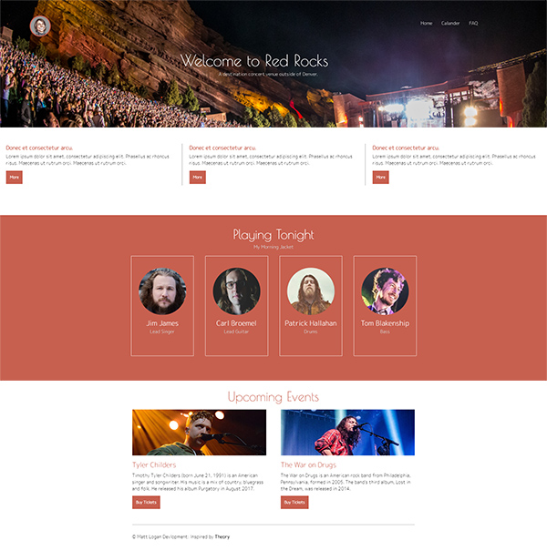

# NSS E12 Exercise - CSS Theme Challenge

## Description:
The objective of this challenge was to recreate a [Templated](https://templated.co/) theme using only HTML and CSS. I chose to recreate the [Theory](https://templated.co/theory) theme. 

## Screenshots:
##### Main View:

## How To Run:
>1. Clone down this repo.
>1. Install [http-server](https://www.npmjs.com/package/http-server).
>1. Navigate to folder in command line and type `http-server -p 8080`.
>1. Go to `http://localhost:8080` in your browser.
